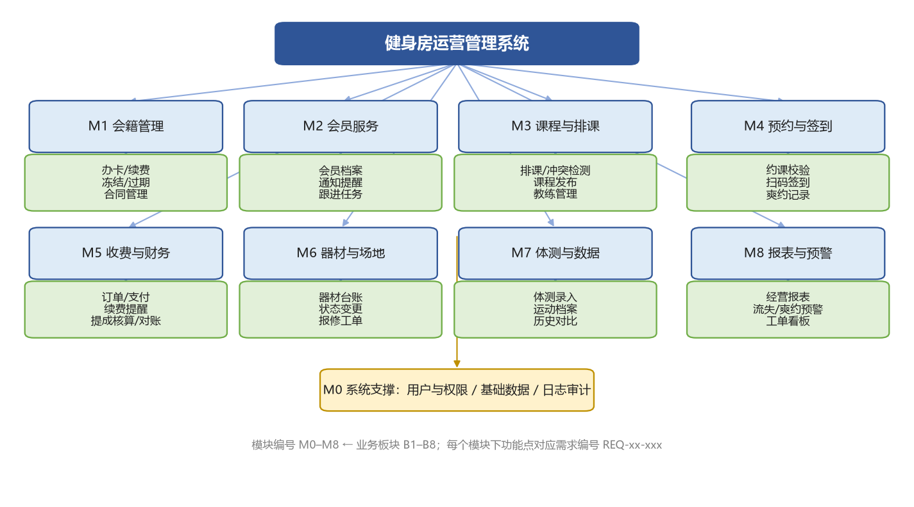
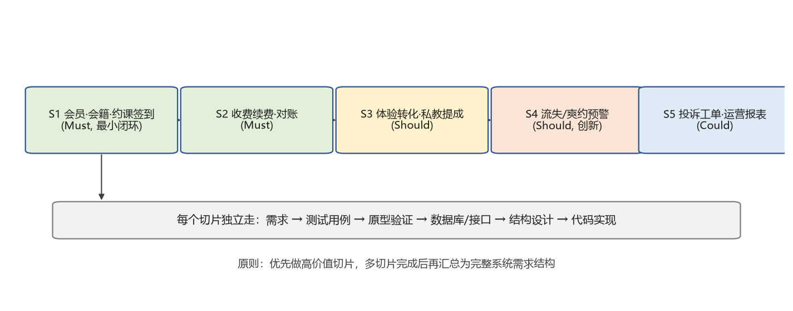

# 目标系统需求分析报告

> 所属阶段：第四阶段（目标系统需求分析报告）
> 上游依据：《业务基线 V1.0（冻结版）》、《业务分析报告（确认版）》《业务流程优化说明》《人机分工清单》
> 需求编写规范：EARS（Ubiquitous / Event-driven / Unwanted / State-driven / Optional）
> 编号规范：
> - **系统目标** `GOAL-01 ~ GOAL-04`
> - **功能需求** `REQ-B<板块号>-<三位序号>`（对应业务板块 B1–B8；支撑类为 `REQ-M0-<序号>`），**编号全篇唯一且连续，不跳号**
> - **非功能需求** 见《非功能需求初步说明》`NFR-<类别>-<序号>`
> - **系统规则** `SYS-R1 ~ SYS-R10`；**切片** `S1–S6`
> - 模块 M1–M8 ← 业务板块 B1–B8，加系统支撑 M0

## 1. 概述

本报告将已冻结的业务基线逐层转换为系统需求：业务目标→系统目标、业务结构→功能模块、业务角色→用户角色与权限、业务活动→页面操作/接口能力/系统动作、核心对象→领域与数据对象、业务规则→系统规则与校验、状态流转→系统状态机。

系统需求**不一次性、脱离优先级地覆盖所有业务板块**，而是优先围绕高价值业务切片逐步形成；本报告给出切片划分与各切片需求，待多个切片完成后汇总为完整系统需求结构。

## 2. 需求形成方式：切片优先

| 切片 | 范围 | 优先级 | 理由 | 涉及活动/规则 |
|---|---|---|---|---|
| S1 | 会员·会籍·课程·约课签到（最小可用闭环） | Must（P0） | 承载核心价值，跑通即系统可用 | A1–A6，R1–R5 |
| S2 | 收费续费·对账 | Must（P1） | 收入闭环与提醒自动化 | A1/A10，R6 |
| S3 | 体验转化·私教业绩与提成 | Should（P2） | 直接支撑转化与提成目标 | A2/A11，R9/R10 |
| S4 | 流失/爽约预警（创新点） | Should（P2） | 差异化能力，先规则式后模型 | A7–A9，R7/R8 |
| S5 | 投诉工单·运营报表 | Could（P3） | 管理闭环与数据决策 | A10/B8，O8 |
| S6 | 教练协同·场地运营（迭代新增） | Should（P2） | 教练是排课与上课的承担者，场地是除课程外最主要的资源，两者都需要独立入口与冲突约束 | A3/A5/A12，R3 |

切片实施顺序：S1 → S2 → S3 → S4 → S5 → S6；每个切片独立完成"需求→测试→原型→设计→实现"。

> **S6 为本次迭代新增切片**，对应实现中的教练端（我的课表 / 学员名单 / 核销签到）与场地预约（4 个私有场馆 + 1 个公共区域）。

## 3. 业务—系统映射总览

| 业务侧 | 系统侧 | 落地位置 |
|---|---|---|
| 业务目标 | 系统目标 GOAL-01~05（§4） | §4；报表能力见 REQ-B8-009 |
| 业务结构 B1–B8 | 系统功能模块 M1–M8 | §5 功能需求 |
| 业务角色 | 系统用户角色与权限 | 《用户角色与权限说明》 |
| 业务流程 | 系统流程与人机协作流程 | 《人机协作流程说明》 |
| 业务活动 A1–A11 | 页面操作/接口能力/系统动作 | §5、§9 |
| 核心对象 O1–O8 | 领域对象与数据对象 | §8 |
| 信息流转 | 页面字段/接口参数/数据库字段/报表需求 | §8、§9、《输出报表与统计需求说明》 |
| 状态流转 | 系统状态机 | 《系统状态流转说明》 |
| 业务规则 R1–R10 | 系统规则与校验、测试用例 | 《系统规则与约束说明》《关键规则—需求—测试溯源表》 |
| 异常情况 | 异常流程/工单/告警/补偿 | §10 |
| 可由系统承担的活动 | 自动化功能 | §5（标记"自动"） |

## 4. 系统目标

- **GOAL-01** 支撑月会员流失率 8%→5%、爽约率 25%→15%、体验转化 30%→40%（与业务基线一致，可验证）。
- **GOAL-02** 90% 以上日常约课与签到无需人工介入。
- **GOAL-03** 会籍到期提醒、提成核算、对账、报表实现自动化。
- **GOAL-04** 流失与爽约风险可预警、可跟进、可闭环。
- **GOAL-05** 教练与场地资源可自助预约、可被门店统一编排，且资源占用不冲突。（S6）

## 5. 功能需求（按模块，EARS 句式）

### S1（Must）：M1 会籍管理 / M3 课程与排课 / M4 预约与签到

- **REQ-B1-001（Ubiquitous）** 系统应维护会员档案与状态（潜在/有效/冻结/过期），所有状态变更应留痕（操作人、时间、原因）。
- **REQ-B1-002（Event-driven）** 当会员完成购卡支付时，系统应生成会籍合同并将其状态置为"有效"。
- **REQ-B1-003（State-driven）** 在会籍处于"冻结"状态下，系统应禁止该会员发起预约。
- **REQ-B1-004（Event-driven）** 当会籍距到期日 ≤ 7 天时，系统应向会员发送续费提醒。（R6，D=7）
- **REQ-B1-005（Unwanted）** 若会籍已过期，则系统应拦截其预约请求并引导续费。
- **REQ-B3-001（Event-driven）** 当教练提交排课时，系统应校验教练、场地与时间冲突；存在冲突时应拒绝并提示具体冲突项。
- **REQ-B3-002（Event-driven）** 当课程发布时，系统应按容量开放预约名额，并支持候补队列。
- **REQ-B1-006（Event-driven）** 当访客提交注册信息（用户名、密码、姓名、手机号）时，系统应在同一事务内创建登录账号、会员档案与角色绑定，并自动生成会员编号（M001 起），注册成功后直接签发令牌进入会员端。
- **REQ-B3-003（Ubiquitous）** 系统应支持**排课**（新建课程）由管理员与店长共同承担；会员不得排课，越权请求应返回 403。
- **REQ-B4-001（Event-driven）** 当会员提交预约时，系统应依次校验会籍有效性（R1）、课程容量与同成员时间冲突（R3）；校验失败应返回明确原因。
- **REQ-B4-002（Event-driven）** 当会员扫码签到时，系统应将该预约状态更新为"已签到"并记录签到时间。
- **REQ-B4-003（Unwanted）** 若预约会员在课程开始后 15 分钟（可配置）内未签到且未取消，则系统应将该预约标记为"爽约"并累计爽约次数。
- **REQ-B4-004（State-driven）** 当会员累计爽约达 3 次时，系统应在 7 天内限制其预约权限（R4，N=3）。
- **REQ-B4-005（Optional）** 在会员无法使用小程序的条件下（可选），系统应允许前台代签与代约，并记录代办人。
- **REQ-B5-002（Event-driven）** 当私教课程结课时，系统应按 R5 自动核销该会员的私教课包次数，次数为 0 时禁止再排课。
- **REQ-B4-006（Event-driven）** 当会员提交选课时，系统应为其本人创建报名记录；重复提交应保持幂等；当会员发起退课时，系统应校验"仅已预约状态可退、课程开始后不可退"，并即时释放名额。
- **REQ-B4-007（Event-driven）** 当会员请求签到时，系统应生成含"预约号 + 会员号"的**二维码**作为签到凭据；门店扫码核销后应记录渠道为"扫码"；重复核销应返回状态冲突。
- **REQ-B4-008（Event-driven）** 当门店后台或任课教练查询某课程时，系统应返回该课程的**全部报名名单**（含会员姓名、会员编号、状态与签到渠道）；会员与非本课教练不得查看。

### S2（Must）：M5 收费与财务

- **REQ-B5-001（Event-driven）** 当订单支付成功时，系统应记录订单并更新会籍有效期或课包余额。
- **REQ-B5-003（Event-driven）** 当月度结算触发时，系统应生成对账单供财务核对确认（A10）。
- **REQ-B5-004（Unwanted）** 若支付回调失败或支付金额与订单不一致，则系统应标记订单为异常并触发告警，且不得变更会籍状态。
- **REQ-B5-006（Event-driven）** 当会籍到期且未续费时，系统应将会员状态置为"过期"并按 R7 纳入流失风险观察。

### S3（Should）：M2 会员服务 / M5 收费与财务 / M7 体测与数据

- **REQ-B2-001（Event-driven）** 当会员办卡后 30 天内到店次数 < 2 次时，系统应生成跟进任务并分配至会籍顾问（R9）。
- **REQ-B2-002（Event-driven）** 当系统生成跟进任务时，系统应通知责任人并支持记录跟进结果（电话/微信/到店）。
- **REQ-B5-005（Event-driven）** 当月末结算触发时，系统应按 R10 自动核算私教业绩与提成，生成提成报表供店长确认。
- **REQ-B7-001（Event-driven）** 当私教录入体测数据时，系统应保存为会员体测档案，字段包含身高、体重、BMI、体脂率、围度。
- **REQ-B7-002（Ubiquitous）** 系统应支持体测历史记录的对比展示（时间序列）。

### S4（Should，创新）：M8 报表与预警

- **REQ-B8-001（Event-driven）** 系统应每日计算会员流失风险等级（R7），输出风险清单。
- **REQ-B8-002（Event-driven）** 当会员连续 4 周未到店，或近 30 天爽约率 > 30% 时，系统应将其标记为"高风险"并生成跟进任务。
- **REQ-B8-003（Event-driven）** 系统应对即将开始的预约预测爽约概率（R8）。
- **REQ-B8-004（Event-driven）** 当某预约爽约概率 > 0.6 且课程已满员时，系统应释放该名额并通知候补会员（R8，T=0.6）。
- **REQ-B8-005（Event-driven）** 当某预约爽约概率 > 0.6 且课程未满员时，系统应向该会员发送到店提醒。
- **REQ-B8-006（Unwanted）** 若预警任务超过 48 小时未被处理，则系统应升级提醒至店长。

### S5（Could）：M8 报表与预警 / M6 器材与场地

- **REQ-B8-007（Event-driven）** 当会员提交投诉/报修/受伤登记时，系统应生成工单并通知店长（O8）。
- **REQ-B8-008（State-driven）** 在工单处于"处理中"状态时，系统应允许记录处理过程；工单关闭前应填写处理结果。
- **REQ-B8-009（Ubiquitous）** 系统应提供经营报表与预警看板（详见《输出报表与统计需求说明》）。
- **REQ-B6-001（Event-driven）** 当器材状态变更（可用/维修/借出）时，系统应记录变更并支持生成报修工单。

### S6（Should，迭代新增）：M3 课程与排课 / M6 器材与场地

- **REQ-B3-004（Ubiquitous）** 系统应维护**教练档案**（编号、姓名、手机号、擅长项目、状态、关联登录账号）；教练档案被课程引用，因此不提供物理删除，停用应改为"休假"状态。
- **REQ-B3-005（Event-driven）** 当教练账号登录时，系统应识别其为独立角色（COACH）并进入教练端；教练应能查看**自己的课表**与所授课程的学员名单。
- **REQ-B3-006（Event-driven）** 当教练对**自己所授课程**的报名会员核销签到时，系统应完成签到；对非本人课程的核销请求应被拒绝。
- **REQ-B6-002（Ubiquitous）** 系统应维护**场馆档案**：编号、名称、类型（私有场馆 / 公共区域）、容量、位置、按时使用费、状态（可用 / 维护中）；其中私有场馆 4 个、公共区域 1 个。
- **REQ-B6-003（Event-driven）** 当会员或门店提交场地预约时，系统应为其创建预约记录；预约来源应区分"会员自助"与"门店代约"。
- **REQ-B6-004（Unwanted）** 若目标场地在所选时段内已有有效预约，则系统应拒绝本次预约并提示"同一场地时段不可重叠"。
- **REQ-B6-005（State-driven）** 在**私有场馆**上，系统应仅对有效会籍开放预约；在**公共区域**上，系统不应限制会籍状态；维护中的场馆一律不可预约。
- **REQ-B6-006（Event-driven）** 当会员或门店取消场地预约时，系统应释放该时段；重复取消应返回状态冲突。

### S7（Must，迭代新增）：M0 账号与权限 / M3 课表化排课 / M6 场馆占用

> 本组来自第二轮迭代：把"课程管理 / 场馆管理"升级为**课表式管理**，并引入**超级管理员**做账号治理。

- **REQ-M0-006（Ubiquitous）** 系统应提供**超级管理员**角色（最高权限）：可查看全部账号、重置任意账号密码、启用或停用账号；普通管理员与店长不得拥有上述能力，请求应返回 403。
- **REQ-M0-007（Event-driven）** 当超级管理员查看账号总览时，系统应列出每个账号的用户名、姓名、角色、数据归属（绑定的会员 / 教练）、状态、密码状态（是否重置过、何时重置）。
- **REQ-M0-008（Unwanted）** 若系统以不可逆哈希存储密码，则系统**不应**提供查看明文密码的能力；需要掌握某账号凭据时，应由超级管理员执行"重置密码"，系统重置为默认密码并**在响应中返回新密码**，同时记录审计日志。
- **REQ-M0-009（Unwanted）** 若超级管理员尝试停用**当前登录账号**或**另一个超级管理员账号**，则系统应拒绝该操作。
- **REQ-B3-007（Event-driven）** 当任意已登录用户进入课表页面时，系统应按角色返回**周课表**（周一至周日七列，无安排的日期保留为空）：
  会员看到本人已选课程，教练看到本人所授课程，门店后台看到全店课程表；会员与教练传入的任何越权范围参数都应被服务端归一化，不得返回他人课表。
- **REQ-B3-008（Event-driven）** 当门店后台按会员或教练筛选课表时，系统应只返回该会员已选 / 该教练所授的课程，并在课表标题中写明筛选对象。
- **REQ-B6-007（Event-driven）** 当门店后台查看场馆占用课表时，系统应按周展示各场馆的占用时段（含会员姓名、来源），并支持按场馆筛选；已取消的预约不应继续占用课表。
- **REQ-M0-010（Ubiquitous）** 课程管理与场馆管理页面应提供**列表视图 ⇄ 周课表视图**切换；周课表中的课程卡片应可点击进入编辑。
- **REQ-M0-011（Event-driven）** 当本周已无"可报名的未来排课"（演示课程漂移到过去）时，系统应在启动时把基础演示课程与演示场地预约对齐到本周剩余的未来日期，保证课表视图始终有内容；系统内已有本周真实排课 / 占用时不得覆盖。

### 支撑（M0，全部切片共用）

- **REQ-M0-001（Ubiquitous）** 系统应按角色控制功能访问与数据可见范围。
- **REQ-M0-002（Ubiquitous）** 系统应支持基础数据维护（字典、课程目录、器材、教练）。
- **REQ-M0-003（Ubiquitous）** 系统应记录关键操作的审计日志（登录、权限变更、状态变更、财务相关操作）。
- **REQ-M0-004（Ubiquitous）** 系统应提供**两步登录**（先选身份、再输账号密码）；所选身份与账号实际角色不一致时应拒绝登录并提示重新选择；登录后按角色渲染左侧导航，同一时刻只展示一个功能页面。
- **REQ-M0-005（Ubiquitous）** 对课程、场馆、教练等列表类页面，系统应提供**分页**（默认每页 6 条）与关键字搜索，避免单页信息过载。

## 6. 状态机需求

系统应实现会员/会籍、预约、课程、订单、工单五类状态机，状态与迁移条件见《系统状态流转说明》。

## 7. 规则需求

R1–R10 全部转为系统规则（编号 SYS-R1–SYS-R10）与校验逻辑，见《系统规则与约束说明》；关键规则须有对应测试用例，见《关键规则—需求—测试溯源表》。

## 8. 数据需求

- **领域对象**：会员、会籍合同、课程、预约、器材、体测记录、收费订单、工单（对应 O1–O8）。
- **关键字段流转**：页面字段（如约课页：课程、时间、剩余名额）→ 接口参数（memberId, courseId）→ 数据库字段（booking.member_id, booking.course_id, booking.status）。
- **数据口径**：活跃会员=近 30 天有签到记录；爽约率=爽约次数/预约次数；转化率=办卡人数/体验人数（详见报表说明）。

## 9. 接口需求

内部与外部接口清单见《接口契约初步清单》（含微信登录、微信支付、订阅消息、短信等外部依赖）。

## 10. 异常与补偿机制

| 异常场景 | 系统处理 |
|---|---|
| 支付回调失败/金额不符 | 订单标异常 + 告警，会籍不变更（REQ-B5-004） |
| 约课冲突/超额 | 拒绝并提示，或进入候补（REQ-B4-001） |
| 未签到 | 判爽约并累计（REQ-B4-003） |
| 爽约超限 | 限制预约 7 天（REQ-B4-004） |
| 预警任务超时未处理 | 升级提醒店长（REQ-B8-006） |
| 投诉/受伤 | 生成工单跟踪至关闭（REQ-B8-007/008） |
| 小程序不可用 | 前台代签/代约兜底（REQ-B4-005） |
| 重复选课 / 重复退课 | 选课幂等返回同一预约号；退课校验状态，重复退课返回冲突（REQ-B4-006） |
| 重复扫码核销 | 返回状态冲突，不重复核销（REQ-B4-007） |
| 非本人课程的名单/核销请求 | 拒绝（403），只有任课教练与门店后台可操作（REQ-B3-006、REQ-B4-008） |
| 场地时段被占用 | 拒绝预约并提示"同一场地时段不可重叠"（REQ-B6-004） |
| 会籍过期会员预约私有场馆 | 拒绝并引导续费；公共区域不受限（REQ-B6-005） |
| 场馆维护中 | 不可预约（REQ-B6-005） |
| 身份与账号不符 | 登录页拒绝进入并提示重新选择身份（REQ-M0-004） |

## 11. 切片实施与验收口径

- 每个切片完成后须通过：单元测试 → 接口测试 → 契约测试 → 集成测试 → 业务流程测试 → 异常测试 → 行为驱动验收测试。
- 验收以业务目标的可度量指标为准（流失率、爽约率、转化率、人工介入比例）。

## 12. 与其他文档的关系

本报告为第四阶段总纲；追溯关系见《业务—系统需求追溯矩阵》；模块功能见《系统功能结构说明》；权限、流程、状态、规则、报表、非功能与接口分别见同名文档；测试溯源见《关键规则—需求—测试溯源表》。
