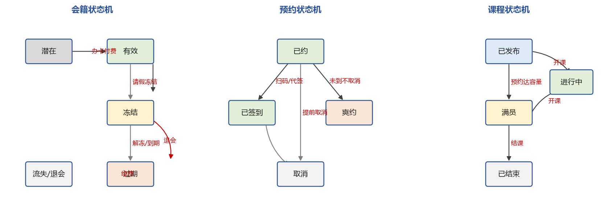

# 系统状态流转说明

> 所属阶段：第四阶段（目标系统需求分析报告）
> 来源：业务规则 R1–R10 与业务对象 O1–O8 的生命周期

## 一、会员/会籍状态机

| 当前状态 | 事件 | 条件 | 下一状态 | 系统动作 |
|---|---|---|---|---|
| 潜在 | 办卡支付成功 | 支付成功 | 有效 | 生成合同（REQ-B1-002） |
| 有效 | 申请冻结 | 审核通过 | 冻结 | 冻结不计有效期（R2） |
| 冻结 | 解冻 | 到期或申请 | 有效 | 恢复约课权限 |
| 有效 | 到期未续费 | 超过到期日 | 过期 | 拦截约课（R1） |
| 过期 | 续费支付成功 | 支付成功 | 有效 | 更新有效期 |
| 有效/过期 | 长期未到店 | 触发 R7 | 流失风险（观察） | 生成跟进任务 |

## 二、预约状态机

| 当前状态 | 事件 | 条件 | 下一状态 | 系统动作 |
|---|---|---|---|---|
| — | 会员提交预约 | 校验通过 | 已约 | 生成预约（REQ-B4-001） |
| 已约 | 扫码/代签 | 在签到窗口内 | 已签到 | 记录签到时间（REQ-B4-002） |
| 已约 | 超时未签到 | 超过开始后 15 分钟 | 爽约 | 累计爽约（REQ-B4-003） |
| 已约 | 会员取消 | 开课前 | 取消 | 释放名额 |
| 已约 | 系统判定高风险爽约 | 概率>0.6 且满员 | 已约（名额释放给候补） | 通知候补（REQ-B8-004） |

## 三、课程状态机

| 当前状态 | 事件 | 下一状态 |
|---|---|---|
| — | 排课发布 | 已发布 |
| 已发布 | 预约达容量 | 满员 |
| 已发布/满员 | 到开课时间 | 进行中 |
| 进行中 | 结课 | 已结束 |

## 四、订单状态机

| 当前状态 | 事件 | 下一状态 | 说明 |
|---|---|---|---|
| 待支付 | 支付成功 | 已支付 | 更新会籍/课包（REQ-B5-001） |
| 待支付 | 超时/取消 | 已取消 | — |
| 已支付 | 退款 | 已退款 | 需财务确认 |
| 待支付 | 回调失败/金额不符 | 异常 | 告警（REQ-B5-004） |

## 五、工单状态机

| 当前状态 | 事件 | 下一状态 | 说明 |
|---|---|---|---|
| — | 提交投诉/报修/受伤 | 待处理 | 通知店长（REQ-B8-007） |
| 待处理 | 受理 | 处理中 | 记录处理人 |
| 处理中 | 处理完成并填结果 | 已关闭 | 关闭须填结果（REQ-B8-008） |

## 六、状态一致性要求

- 状态迁移必须由明确事件与条件触发，禁止人工直接改状态（须走事件）。
- 每次迁移须记录操作人、时间、前后状态与原因。
- 状态机与《系统规则与约束说明》《关键规则—需求—测试溯源表》保持一致。
