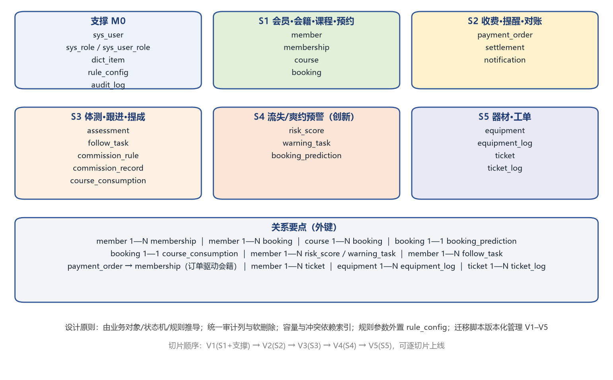

# 数据库设计说明

> 所属阶段：第七阶段（数据库、外部接口、业务数据初始化与部署方案设计）
> 设计方式："全局原则先行、切片逐步细化"
> 数据库：MySQL 8.0 / utf8mb4
> 迁移脚本：`db/migrations/V1__*.sql` ~ `V5__*.sql`（版本化管理，禁止人工直改生产库）

## 一、设计依据（从业务推导，而非凭经验堆表）

数据库设计依据包括：核心业务对象 O1–O8、业务信息项、业务活动 A1–A11 的输入输出、状态机、业务规则 R1–R10、接口交互、日志留痕与统计指标。映射关系如下：

| 设计依据 | 落地对象 |
|---|---|
| 核心业务对象 | member / membership / course / booking / equipment / assessment / payment_order / ticket |
| 状态机 | 各表 status 字段 + dict_item 枚举（与《系统状态流转说明》一致） |
| 业务规则 | rule_config（SYS-R1–R10 参数外置，可配置、可版本化） |
| 业务活动输入输出 | 表字段与接口参数一一对应（如约课：member_id + course_id） |
| 日志留痕 | audit_log、equipment_log、ticket_log |
| 统计指标 | course.booked_count、booking.status、risk_score、commission_record 等支撑 RP1–RP9 |
| 接口交互 | payment_order（订单与回调）、notification（提醒发送与重试） |

## 二、全局设计原则

1. **命名**：小写 snake_case；表名对应领域对象；外键统一 `xxx_id`。
2. **主键**：`id BIGINT AUTO_INCREMENT`；对外暴露业务号（member_no / order_no / ticket_no）。
3. **审计列**：核心表统一含 `created_at / updated_at / created_by / updated_by`。
4. **软删除**：主数据表用 `deleted_at`，不物理删除（合规与追溯）。
5. **金额**：`DECIMAL(10,2)`，禁用浮点。
6. **状态**：`VARCHAR` + 字典枚举，便于扩展；状态迁移只能由业务事件触发，禁止直接改状态。
7. **参数外置**：规则阈值（N/D/T、时间窗、提成比例）全部落 `rule_config`，改参数不改代码。
8. **可解释性**：预测与评分表保留 `detail_json`（命中条件、特征明细），保证可人工核查。
9. **幂等**：`booking` 对 (member_id, course_id) 建唯一键，防止重复提交。
10. **时区**：统一 `Asia/Shanghai (+08:00)`。

## 三、表清单（按切片）

| 切片 | 迁移脚本 | 表 |
|---|---|---|
| 支撑 M0 | V1 | sys_user、sys_role、sys_user_role、dict_item、rule_config、audit_log |
| S1 | V1 | member、membership、course、booking |
| S2 | V2 | payment_order、settlement、notification |
| S3 | V3 | assessment、follow_task、commission_rule、commission_record、course_consumption |
| S4 | V4 | risk_score、warning_task、booking_prediction |
| S5 | V5 | equipment、equipment_log、ticket、ticket_log |

## 四、关键设计说明

- **容量与冲突（SYS-R3）**：`course.booked_count` 冗余计数减少并发校验压力；`idx_course_coach_time`、`idx_course_room_time` 支撑排课冲突检测；`booking` 唯一键防重复。
- **会籍有效性（SYS-R1/R2）**：`membership.status` + `end_date` + `frozen_from/to`，过期与冻结判定不依赖人工。
- **爽约惩罚（SYS-R4）**：由 `booking.status='no_show'` 计数推导，不单独存计数，避免不一致。
- **提醒（SYS-R6）**：`notification` 记录发送状态与重试次数，失败可降级到短信渠道。
- **流失/爽约预测（SYS-R7/R8，创新点）**：`risk_score` 存风险等级与命中条件；`booking_prediction` 存概率、动作与 `model_ver`（先 `rule-v1`，后续演进模型时保留追溯）。
- **提成（SYS-R10）**：`commission_record` 汇总，`course_consumption` 为下钻明细，保证"可核对、可申诉"。

## 五、索引与约束要点

| 表 | 关键索引/约束 | 目的 |
|---|---|---|
| booking | UNIQUE(member_id, course_id)；INDEX(course_id, status) | 幂等 + 签到统计 |
| course | INDEX(coach_id, start_time) | 排课冲突检测 |
| membership | INDEX(member_id, status)；INDEX(end_date) | 约课校验 + 到期扫描 |
| payment_order | UNIQUE(order_no)；UNIQUE(out_trade_no) | 订单唯一、回调幂等 |
| risk_score | UNIQUE(member_id, score_date) | 每日评分不重复 |
| audit_log | INDEX(target_type, target_id) | 追溯与审计 |

## 六、迁移与版本管理

- 采用 **Flyway 风格**命名：`V{n}__描述.sql`（顺序执行、不可修改历史脚本），基础数据用 `R__seed_base_data.sql`（可重复执行、幂等）。
- 上线流程：发布前在预发库回放全部迁移 → 校验 → 生产执行 → 记录版本表（flyway_schema_history）。
- **禁止**直接改生产库结构；任何变更以新增迁移脚本形式提交，并同步更新本文档与测试用例。

## 七、切片细化策略

V1 先支撑 S1 最小闭环（会员/会籍/课程/预约）；每完成一个切片追加一份迁移脚本（V2…V5），无需等待全量设计完成即可上线验证；后续切片表结构不影响已完成切片的既有字段（只增不改）。
