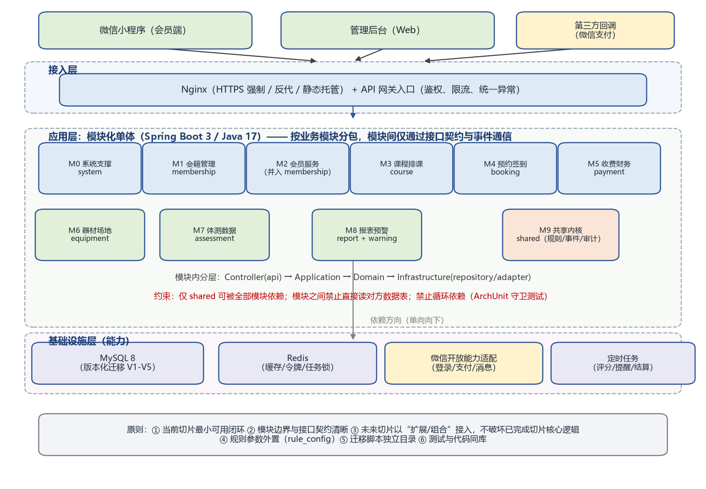

# 系统结构设计说明

> 所属阶段：第八阶段（系统结构与代码结构设计）
> 上游依据：《业务基线 V1.0》《目标系统需求分析报告》《数据库设计说明》《部署方案设计》
> 架构选型：**模块化单体（Modular Monolith）** · Spring Boot 3 / Java 17

## 一、系统结构设计依据（业务 → 系统）

| 业务侧 | 系统侧 | 落地 |
|---|---|---|
| 业务结构 B1–B8 | 系统模块结构 M0–M8 | 按业务模块分包 |
| 业务角色 | 用户与权限模块 | M0 system |
| 业务活动 A1–A11 | 服务能力 | 各模块 Application 服务 |
| 核心业务对象 O1–O8 | 领域对象与数据对象 | 各模块 domain + 数据库表 |
| 业务流程 | 模块协作关系 | 契约调用 + 领域事件 |
| 业务规则 R1–R10 | 规则与校验模块 | shared/rule（参数取 rule_config） |
| 业务状态 | 状态机管理 | 各模块 domain 内的状态机 |
| 报表与指标 | 统计与报表模块 | M8 report（只读聚合，统一口径） |

## 二、架构选型与理由

模板明确要求避免两种极端。本设计选择**模块化单体**：

- ❌ **不选面式代码**：不做"Controller 直接写 SQL、规则硬编码、跨模块随便读表"。
- ❌ **不选过度架构**：首个切片**不引入**微服务、插件化、微内核——单店规模（会员 ≤3000、并发 ≤200）无需分布式复杂度。
- ✅ **选择模块化单体**：一个可部署单元内按业务模块清晰分包，模块间只经**接口契约 + 领域事件**通信，未来切片以"扩展/组合"接入。

**演进路径**：模块化单体 →（若单店扩展为连锁、或某模块成为性能瓶颈）→ 按模块边界平滑拆分为独立服务，因为契约已先行定义，拆分不需重写业务逻辑。

## 三、分层结构

| 层 | 职责 | 包 |
|---|---|---|
| 接入层 | Nginx（HTTPS/反代/静态）+ 统一鉴权、限流、异常处理 | `com.gym.<module>.api`（Controller/Assembler） |
| 应用层 | 编排用例、事务边界、发布事件 | `com.gym.<module>.application` |
| 领域层 | 领域对象、状态机、规则判定、领域服务 | `com.gym.<module>.domain` |
| 基础设施层 | 持久化实现、外部接口适配、定时任务 | `com.gym.<module>.internal` / `infrastructure` |

依赖方向**单向向下**：`api → application → domain ← infrastructure`；`domain` 不依赖框架与外部实现。

## 四、模块清单与职责

| 模块 | 对应业务 | 核心职责 | 数据归属 |
|---|---|---|---|
| M0 system | 角色与基础数据 | 用户/角色/权限、字典、规则参数、审计 | sys_*、dict_item、rule_config、audit_log |
| M1 membership | B1+B2 | 会员档案、办卡续费、冻结过期、跟进任务 | member、membership、follow_task |
| M3 course | B3 | 课程目录、排课、冲突检测、名额 | course |
| M4 booking | B4 | 约课校验、签到、爽约判定与惩罚 | booking |
| M5 payment | B5 | 订单支付、回调幂等、核销、对账、提成 | payment_order、settlement、commission_*、course_consumption |
| M6 equipment | B6 | 器材台账、状态变更、场地占用 | equipment、equipment_log |
| M7 assessment | B7 | 体测建档与档案对比 | assessment |
| M8 report | B8 | 报表 RP1–RP9、工单闭环 | ticket、ticket_log |
| warning | B8（创新） | 流失风险评分、爽约预测、预警任务 | risk_score、warning_task、booking_prediction |
| **shared** | — | 规则引擎、领域事件、审计、通用类型 | —（无表） |

## 五、模块协作与依赖规则

1. **唯一公共依赖**：只有 `shared` 可被所有模块依赖；`shared` 不得依赖任何业务模块。
2. **契约化协作**：跨模块调用**只能**通过对方 `api` 包的 Facade 接口，**禁止**依赖对方 `internal`，**禁止**直接读对方数据表。
3. **事件解耦**：状态变化通过领域事件广播（如 `BookingCheckedInEvent` → payment 触发课消、warning 更新活跃度），调用方无需知道订阅方。
4. **禁止循环依赖**：模块依赖须为有向无环图。
5. **自动化守卫**：以上约束由 ArchUnit 测试固化（`backend/src/test/java/com/gym/architecture/ModuleBoundaryTest.java`），破坏即构建失败。

**典型协作链（约课 → 签到 → 课消）**：
`booking` 校验时经 `MembershipFacade` 查会籍、经 `CourseFacade` 占用名额 → 签到成功发布 `BookingCheckedInEvent` → `payment` 订阅后核销课包与记录课消 → `warning` 订阅后刷新活跃度。

## 六、关键技术决策

| 决策 | 说明 | 对应要求 |
|---|---|---|
| 规则参数外置 | 阈值落 `rule_config`，改参数不发版；规则实现以策略+参数组合 | 模板"公共规则外置" |
| 幂等设计 | `booking` 唯一键 + 支付回调按 `out_trade_no` 去重 | REQ-B4-001 / REQ-B5-004 |
| 状态机集中 | 状态迁移只能由业务事件触发，统一记录审计 | 业务状态 → 状态机管理 |
| 可解释预测 | 预测/评分保留 `detail_json` 与 `model_ver` | 创新点可信度 |
| 迁移脚本独立 | Flyway 脚本位于 `07-数据库与部署设计/db/migrations`，与代码同库 | 版本化管理 |
| 测试同库 | `.feature` 与单元/架构测试同库管理 | 模型—测试—代码物理绑定 |

## 七、切片落地策略

- **S1（当前）**：只实现 membership / course / booking + system 最小闭环，不引入 payment 的真实支付（先用 Mock 适配器），保证最小可用且可验证。
- **扩展点预留**：`payment` 的外部依赖以适配器 + 接口隔离，接真实微信支付时只替换适配器实现；`warning` 以 `rule-v1` 起步，后续替换评分策略不影响调用方。
- **接入原则**：后续切片只**新增模块或新增方法**，不修改已完成切片的核心逻辑与既有契约（契约变更须走版本化流程）。
