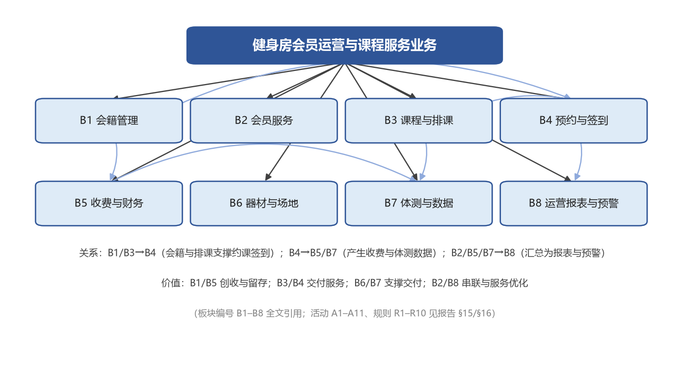
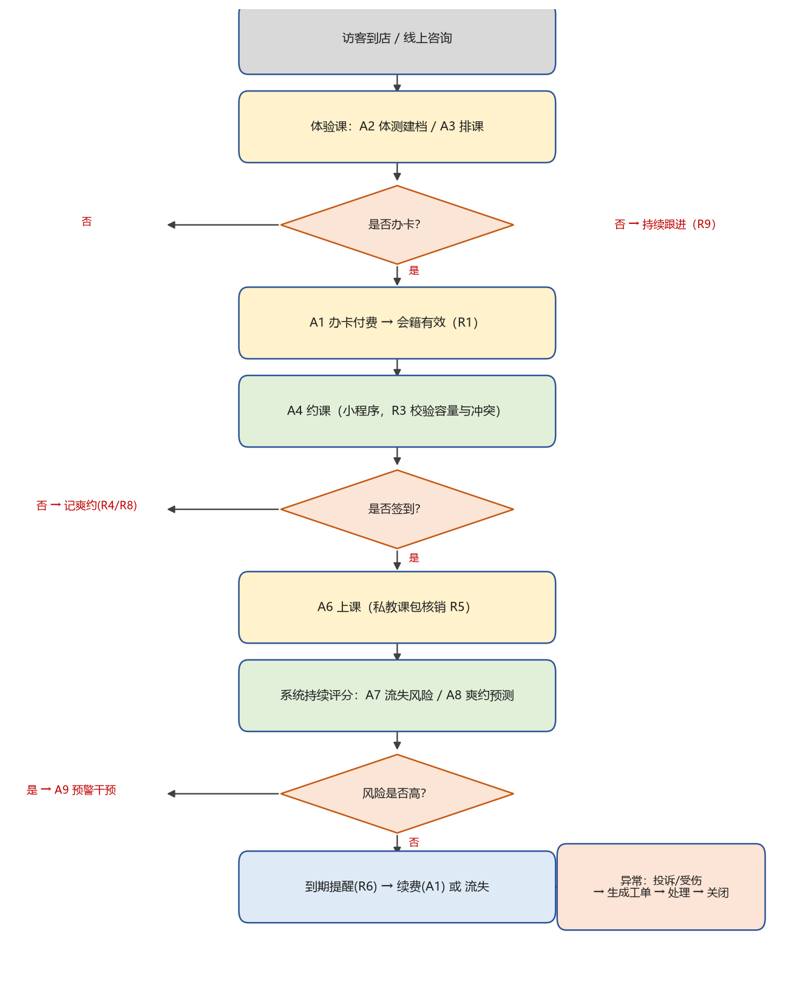

# 业务分析报告

> 所属阶段：第二阶段（业务分析报告）
> 分析对象：健身房会员运营与课程服务业务
> 上游依据：《业务定位说明》与《业务基线 V0.1》（店长已签字确认）
> 说明：本报告按模板第二阶段 18 个小节逐条对应编写；业务模型编号（对象、板块 B、活动 A、规则 R）全文统一，供后续需求分析与测试追溯。

## 1. 业务分析的正确开展顺序

业务分析应按照"先定性、再结构、后流程"的顺序开展：

- **先定性**：明确业务名称、定位、背景、目标和边界（见 §3–§10）。
- **再结构**：识别核心业务对象、业务结构、业务角色和业务活动（见 §12–§15）。
- **后流程**：梳理业务规则、决策逻辑和 B0 总体业务流程（见 §16–§18）。

不应一上来就画流程图或写功能清单。本报告严格遵循该顺序：先讲清"这是一件什么事"，再拆结构，最后落到规则与流程，避免把系统功能混入业务分析。

## 2. 业务输入与材料整理

收集与业务相关的既有材料，整理为《业务主题输入清单》如下：

| 编号 | 材料名称 | 来源 | 形式 | 可信程度 | 主要用途 |
|---|---|---|---|---|---|
| M1 | 门店会员登记表、会籍台账 | 门店现场 | 纸质/Excel | 高 | 会员与会籍对象、办卡流程 |
| M2 | 微信群排课与接龙记录 | 门店历史记录 | 聊天记录 | 中 | 排课/约课现状与痛点 |
| M3 | 收费台账、续费记录 | 门店/财务 | 纸质/Excel | 高 | 收费对象与规则、提醒需求 |
| M4 | 私教课程与课包销售记录 | 门店 | 纸质/系统 | 中 | 课包核销、业绩提成 |
| M5 | 体测表模板 | 私教 | 纸质模板 | 中 | 体测指标与档案结构 |
| M6 | 行业公开资料（流失率/爽约率/转化率区间） | 公开渠道 | 文章/报告 | 中 | 目标值参照与基线判断 |
| M7 | 与店长/会籍/私教访谈纪要 | 门店访谈 | 记录 | 高 | 角色职责、真实诉求 |
| M8 | 店长 C1 审阅意见（量化目标与规则参数） | 店长审阅 | 记录 | 高 | 目标量化、规则参数确定 |

材料可信度分级：高（可直接作为业务事实依据）、中（需与业务方二次确认）。M6 属行业参照，不作为本店既定事实；M8 已并入《业务基线 V0.1》。

## 3. 业务名称

**健身房会员运营与课程服务业务。**

名称采用"某某业务"的表达，而非直接写成"某某系统"，以明确分析对象是现实业务。该名称已在《业务定位说明》《业务分析报告》《业务基线》中保持一致，后续需求、设计、代码文档沿用同一名称。

## 4. 业务定位

- **业务类型**：面向单店健身房的持续性服务运营型业务（非一次性交付型）。
- **服务对象**：健身会员（个人用户）与门店运营方（店长、会籍顾问、私教）。
- **围绕什么对象运行**：会员与会籍合同为核心，围绕课程、预约、签到、收费、体测、器材与工单展开。
- **解决什么问题**：约课冲突、爽约浪费、会员流失无预警、体验转化低、私教业绩不透明、投诉无闭环、数据割裂。
- **创造什么价值**：提升会员留存与体验转化，降低资源浪费，让运营从"凭经验"转为"看数据"。
- **系统承担的作用**：统一"会员—会籍—课程—预约—签到—收费—预警"，承接可自动化活动（预约校验、签到、提醒、风险评分、业绩核算），人负责服务与决策（体测、私教、销售、干预、投诉处理）。

## 5. 业务背景

- **外部环境**：健身行业竞争激烈，会员月流失率高、团课与私教爽约率高是普遍现象。
- **政策/合规依据**：涉及会员个人信息与健康数据，须遵循个人信息保护相关要求（数据最小化、授权采集）。
- **组织动因**：门店运营精细化要求提高，管理层需要可量化、可追溯的数据支撑决策。
- **现状**：排课与签到依赖微信群接龙与纸质登记，会员、体测、收费数据相互割裂。
- **为什么现在做、由谁发起**：由店长发起，目标是降低流失与爽约、提升转化与提成透明度。
- **与既有业务的关系**：不推翻现有线下运营，而是将主流程线上化并叠加数据预警能力。

## 6. 业务痛点与问题

| 编号 | 痛点 | 领域 | 类型归属 |
|---|---|---|---|
| P1 | 约课靠接龙，超额与冲突难管控 | 效率/协同 | 可通过系统解决 |
| P2 | 爽约无预警，教练与场地空置 | 成本 | 可通过系统解决 |
| P3 | 会员流失靠"感觉"，挽留滞后 | 数据/经营 | 系统预警 + 人工干预 |
| P4 | 体验课转化无跟踪，访客流失 | 经营 | 系统跟踪 + 人工跟进 |
| P5 | 私教业绩与提成靠手工算，易错易争议 | 管理/信任 | 可通过系统解决 |
| P6 | 投诉/受伤无闭环工单，处理靠口头 | 质量/合规 | 可通过系统解决 |
| P7 | 体测/签到数据分散，无连续档案 | 数据 | 可通过系统解决 |
| P8 | 缺乏数据看板，难量化运营 | 数据/决策 | 可通过系统解决 |

说明：P1–P8 中除 P3、P4 需要"系统 + 人工"配合外，其余均可通过系统解决或显著改善；门店销售话术、教练服务质量等属组织与流程问题，不在系统解决范围内。

## 7. 业务目标

- **服务目标**：会员通过微信小程序自助查询、约课、扫码签到、查看个人体测与运动记录；90% 以上日常约课无需人工介入。
- **经营目标（店长确认，可验证）**：
  - 会员月流失率：由约 8% 降至 5%；
  - 团课/私教爽约率：由约 25% 降至 15%；
  - 体验课转化率：由约 30% 提升至 40%。
- **管理目标**：运营数据自动汇总，流失风险、爽约风险与投诉工单可预警、可跟进、可闭环；私教业绩与提成自动核算、可追溯。

以上目标为后续需求优先级排序与验收标准提供依据。

## 8. 业务范围与边界

- **覆盖板块**：B1 会籍管理、B2 会员服务、B3 课程与排课、B4 预约与签到、B5 收费与财务（含私教提成）、B6 器材与场地、B7 体测与数据、B8 运营报表与预警。
- **覆盖环节**：办卡续费、排课、约课、签到、上课、收费、体测、私教业绩、投诉工单、预警与报表。
- **不覆盖内容**：多门店连锁与跨店结算、器材采购供应链、财务总账、硬件门禁/闸机与人脸识别、直播课与线上付费内容。
- **上下游接口关系**：
  - 上游：支付渠道（收费）、消息渠道（小程序订阅消息/短信，提醒）。
  - 下游：门店财务（对账数据）、运营决策（报表与预警数据）。
- **防蔓延约定**：任何新增板块须回到 §8 更新范围并升版基线，不得在需求阶段私自扩张。

## 9. 服务对象

| 类别 | 特征 | 规模（示例） | 差异化管理要求 |
|---|---|---|---|
| 健身新手 | 目标模糊、易流失、需引导 | 占会员约 40% | 首月重点跟进（R9）、体测建档、推荐团课 |
| 进阶训练者 | 目标明确、频率高 | 约 35% | 私教课包、训练计划、数据追踪 |
| 团课爱好者 | 社交驱动、看排课 | 约 20% | 课程容量与候补、爽约约束 |
| 企业/团建客户 | 批量购买、按团队管理 | 约 5% | 批量办卡、对公结算（本轮仅预留，不实现） |

## 10. 付费方式或价值承担方

- **谁付费**：会员购买会籍与课程；门店承担系统建设与运行成本。
- **计费方式**：
  - 会籍：月卡 / 季卡 / 年卡，按期计费；
  - 课程：团课按次，私教按课包（单次 / 10 次 / 30 次）计费。
- **运行成本承担方**：门店承担服务器、消息推送、支付手续费等运行成本。
- **免费服务的价值补偿**：签到、体测查看、预警提醒对会员免费，其成本由门店以会员留存与转化价值补偿。

## 11. 系统使用者

| 角色 | 使用场景 | 频率 | 权限关注点 |
|---|---|---|---|
| 会员 | 小程序约课、扫码签到、付费、查记录 | 每周数次 | 仅见本人数据 |
| 会籍顾问 | 办卡、续费、跟进新会员/高风险会员 | 每日 | 客户与跟进信息，不可改财务 |
| 私教 | 排课、上课、体测录入、看业绩 | 每日 | 仅见所带会员与本人业绩 |
| 店长 | 看报表、处理预警与投诉、配置规则与提成 | 每日 | 全局可见，最高配置权 |
| 财务 | 对账、核对订单 | 每周/每月 | 财务数据，不可改业务记录 |
| 系统管理员 | 用户权限、基础数据维护 | 按需 | 系统配置，不见业务明细 |

## 12. 核心业务对象

| 编号 | 对象 | 含义 | 关键属性 | 生命周期 | 归属 |
|---|---|---|---|---|---|
| O1 | 会员 | 购买会籍的个人 | 会员ID、姓名、联系方式、注册日期、风险等级、状态 | 潜在→有效→冻结/过期→流失 | 门店 |
| O2 | 会籍合同 | 会员的会籍约定 | 类型(月/季/年)、起止日期、状态、剩余次数 | 生效→到期/冻结→续费或失效 | 门店 |
| O3 | 课程 | 团课或私教课 | 类型、名称、教练、时间、容量、状态 | 已发布→满员/进行中→已结束 | 门店 |
| O4 | 预约 | 会员对课程的预约 | 会员、课程、状态、爽约概率 | 已约→已签到/爽约/取消 | 会员 |
| O5 | 器材 | 场馆设备 | 名称、状态(可用/维修/借出) | 可用↔维修↔借出 | 门店 |
| O6 | 体测记录 | 会员体测档案 | 会员、日期、身高/体重/BMI/体脂率/围度 | 持续新增，长期保存 | 会员 |
| O7 | 收费订单 | 收费与续费记录 | 会员、金额、类型、状态 | 待支付→已支付/已退款 | 门店 |
| O8 | 工单 | 投诉/报修/受伤记录 | 会员、类型、状态、处理人 | 待处理→处理中→已关闭 | 门店 |

## 13. 业务结构

业务分解为 8 个主要业务板块（编号 B1–B8），各板块职责与价值如下：

- **B1 会籍管理**：办卡、续费、冻结、过期。职责：守住会籍有效性与收入入口；价值：创收与留存。
- **B2 会员服务**：档案、通知、新会员与高风险会员跟进。价值：串联服务、降低流失。
- **B3 课程与排课**：团课与私教排课、冲突检测。价值：保障服务供给。
- **B4 预约与签到**：小程序约课、扫码签到、前台代签、爽约记录。价值：核心服务交付入口。
- **B5 收费与财务**：订单、续费、私教业绩与提成、对账、提醒。价值：收入与绩效透明。
- **B6 器材与场地**：器材状态、场地占用。价值：支撑服务交付。
- **B7 体测与数据**：体测建档、运动档案。价值：数据积累与专业度。
- **B8 运营报表与预警**：报表、流失/爽约风险评分、投诉工单看板。价值：数据化决策。

**关键关系**：B1/B3→B4（会籍与排课支撑约课签到）；B4→B5/B7（产生收费与体测数据）；B2/B5/B7→B8（汇总为报表与预警）。板块编号 B1–B8 在全文及后续文档中统一引用。

## 14. 业务角色与职责

| 角色 | 类型 | 主要职责（按板块） | 协作关系 |
|---|---|---|---|
| 会员 | 外部 | B4 约课/签到、B5 付费、B7 查看体测、B8 提交投诉 | 与会籍、私教、前台协作 |
| 会籍顾问 | 组织内 | B1 办卡续费、B2 跟进高风险/新会员 | 与店长、财务协作 |
| 私教 | 组织内 | B3 排课、B4 上课、B7 体测建档 | 与会籍、店长协作 |
| 店长 | 组织内 | B8 报表与预警、处理投诉、配置规则与提成 | 全局协调 |
| 财务 | 组织内 | B5 对账、核对订单 | 与店长、会籍协作 |
| 系统管理员 | 组织内 | 用户权限、基础数据（字典/课程目录/器材） | 支撑所有角色 |

## 15. 业务活动

| 编号 | 活动 | 所属板块 | 执行角色 | 使用对象 | 输入 | 输出 | 触发条件 | 人机分工 |
|---|---|---|---|---|---|---|---|---|
| A1 | 办卡/续费 | B1 | 会籍顾问+会员 | O1,O2,O7 | 会员信息、会籍类型、支付 | 会籍合同（有效） | 会员决定办卡 | 人主导，系统记录 |
| A2 | 体测建档 | B7 | 私教 | O1,O6 | 身高/体重/BMI/体脂率/围度 | 体测记录 | 体验课/定期体测 | 人完成 |
| A3 | 排课 | B3 | 私教/店长 | O3 | 时间、教练、场地、容量 | 已发布课程 | 周期性排课 | 系统辅助冲突检测 |
| A4 | 约课 | B4 | 会员 | O2,O3,O4 | 课程选择 | 预约（已约） | 会员在小程序操作 | 系统校验容量与冲突 |
| A5 | 签到 | B4 | 会员/前台 | O4 | 到店确认（扫码/代签） | 预约状态（已签到/爽约） | 到店或开课时点 | 系统承担 |
| A6 | 上课 | B3/B4 | 私教 | O3,O4,O2 | 课程与会员 | 课包核销、活跃度更新 | 到课并开课 | 人完成，系统核销 |
| A7 | 流失风险评分 | B8 | 系统 | O1,O4,O2 | 签到频率、爽约率、剩余时长 | 风险等级 | 定时（每日） | 系统承担 |
| A8 | 爽约预测 | B8 | 系统 | O4 | 历史预约与签到行为 | 爽约概率 | 预约产生/课程开始前 | 系统承担 |
| A9 | 预警干预 | B2/B8 | 店长/会籍 | O1,O8 | 风险清单 | 跟进任务与结果 | 风险评为高 | 人决策 |
| A10 | 对账 | B5 | 财务 | O7 | 订单与到账流水 | 对账结果 | 周/月结算 | 人完成，系统供数 |
| A11 | 私教业绩与提成统计 | B5 | 系统+店长 | O2,O7 | 课消次数/金额、提成规则 | 业绩与提成报表 | 月末 | 系统核算，店长确认 |

**必须由人完成**：A2 体测评估、A6 私教指导、A1 销售谈判、投诉/受伤处理（人决策与情感沟通）。
**可由系统承担或辅助**：A3 冲突检测、A4 约课校验、A5 签到、A7/A8 评分预测、A9 任务生成、A11 业绩核算、到期与爽约提醒、报表生成。

## 16. 业务规则与决策

按规则类型归类（准入 / 校验 / 计算 / 状态迁移），全部可编号、可测试：

- **R1 会籍有效期（准入）**：仅"有效"状态会员可约课；过期需续费。
- **R2 请假冻结（状态迁移）**：会员可申请冻结，冻结期不计入有效期，冻结期间不可约课。
- **R3 约课上限与冲突（校验）**：单课程预约数不超过容量；同会员同时间仅一个预约；排课时间/教练/场地冲突时系统拒绝。
- **R4 爽约惩罚（计算+准入，N=3）**：累计爽约达 3 次，限制后续预约权限 7 天。
- **R5 私教课包核销（计算）**：上课即扣减剩余次数，次数为 0 不可排课。
- **R6 到期提醒（计算，D=7）**：会籍到期前 7 天自动提醒续费。
- **R7 流失风险规则（计算）**：连续 4 周未到店，或近 30 天爽约率 > 30%，标记高风险并生成跟进任务。
- **R8 爽约预测规则（计算，T=0.6）**：单次预约爽约概率 > 0.6 时发送提醒；课程满员时优先释放名额给候补。
- **R9 新会员首月跟进（计算）**：办卡后 30 天内到店 < 2 次，标记并分配会籍顾问跟进。
- **R10 私教业绩提成（计算）**：按当月私教课消次数/金额计提提成，比例由店长配置。

**决策表（爽约处理，示例）**：

| 爽约概率 | 课程是否满员 | 系统动作 |
|---|---|---|
| > 0.6 | 否 | 发送提醒，正常保留名额 |
| > 0.6 | 是 | 释放名额并通知候补 |
| ≤ 0.6 | 否 | 无动作 |
| ≤ 0.6 | 是 | 排队候补 |

**状态迁移条件（摘要）**：会员状态（潜在→有效→冻结/过期→流失）；预约状态（已约→已签到/爽约/取消）；课程状态（已发布→满员/进行中→已结束）；工单状态（待处理→处理中→已关闭）。

## 17. B0 总体业务流程

B0 总流程回答：业务从哪里开始、经过哪些板块、有哪些关键判断/分支/循环/异常、最终形成什么结果。

**主流程**：
访客到店/线上咨询 → 体验课（A2 体测 / A3 排课） → [R9 首月跟进] → 办卡付费（A1，会籍有效 R1） → 约课（A4，R3 校验） → 签到（A5） → 上课（A6，R5 核销） → [系统持续评分 A7/A8] → 低风险：正常运营 / 高风险：预警干预（A9） → 到期提醒（R6） → 续费（A1） 或 流失。

**关键判断/分支/异常**：
- 是否办卡？否 → 持续跟进（R9）。
- 会籍是否有效？否 → 引导续费（R6 提醒）。
- 预约是否冲突/超额？是 → 拒绝或候补（R3）。
- 是否签到？否 → 记爽约（R4/R8）。
- 风险是否高？是 → 触发 A9 干预（循环：每次评分后复判）。
- 是否提交投诉/受伤？是 → 生成工单（O8）→ 处理 → 关闭（B8 看板）。

**可视化流程模型说明**：跨角色流程优先使用 BPMN 泳道图（会员/会籍/私教/店长/财务/系统各一泳道），系统内部自动化流程（评分、预测、提醒）可用 UML 活动图。上图为本业务的 B0 可视化流程模型，与 §13 板块编号、§14 角色名称、§15 活动名称及输入输出保持一致。

## 18. 各业务板块粗粒度流程与全局业务基线确认

**各板块粗粒度流程**：

- **B1 会籍管理**：咨询 → 选类型（月/季/年） → 付费 → 合同生效 → 到期/续费/冻结（R1/R2/R6）。
- **B2 会员服务**：建档 → 通知/提醒 → 新会员首月跟进（R9） → 高风险跟进（R7） → 结果记录。
- **B3 课程与排课**：提报时间/教练/场地 → 冲突检测（R3） → 发布课程 → 开课 → 结课。
- **B4 预约与签到**：浏览课程 → 小程序约课（R3） → 到店扫码/前台代签 → 上课 → 爽约记录（R4/R8）。
- **B5 收费与财务**：订单生成 → 支付 → 续费提醒（R6） → 私教课消 → 提成核算（R10） → 对账（A10）。
- **B6 器材与场地**：器材登记 → 状态变更（可用/维修/借出） → 场地占用登记 → 报修工单（O8）。
- **B7 体测与数据**：体测建档（O6） → 指标录入 → 档案累积 → 训练建议。
- **B8 运营报表与预警**：数据汇总 → 风险评分（A7/A8） → 预警生成（A9） → 工单看板 → 经营报表。

**全局业务基线一致性核对**：

| 核对项 | 核对内容 | 结论 |
|---|---|---|
| 结构 vs 流程 | B1–B8 是否都在 B0 或板块流程中出现 | 一致，无孤立板块 |
| 角色 vs 活动 | 每个角色是否至少承载一个活动 | 一致 |
| 对象 vs 活动 | 每个对象是否至少被一个活动使用 | 一致 |
| 规则 vs 活动 | 每条规则是否约束至少一个活动 | 一致 |
| 编号一致性 | 板块/活动/规则编号是否全文一致 | 一致 |
| 流程断点 | 主流程是否存在断点或矛盾 | 无断点 |

**冻结说明**：全部板块流程完成后，经上述一致性核对通过，本报告冻结为《业务分析报告（确认版）》，并据此形成《业务基线 V1.0》，作为后续目标系统需求分析的统一输入。

---

## 附 A：店长 C1 审阅改进项落地对照

| 改进项 | 落地位置 |
|---|---|
| 量化目标（流失 8→5%、爽约 25→15%、转化 30→40%） | §7 经营目标 |
| R4 N=3、R6 D=7、R8 T=0.6 | §16 R4/R6/R8 |
| 体验课转化漏斗 | §6 P4、§7、§17 B0 |
| 私教业绩与提成 | §8、§13 B5、§15 A11、§16 R10 |
| 投诉与售后工单 | §12 O8、§15、§17、§18 B6/B8 |
| 微信小程序入口 | §9、§11、§15 A4/A5 |
| 单店确认 | §8 |
| 体测指标具体化 | §12 O6 |
| 课包与定价 | §10、§13 B1/B5 |
| 签到方式（扫码+代签） | §11、§15 A5 |

## 附 B：微创新点（流失/爽约预测）在业务模型中的映射

| 维度 | 映射位置 |
|---|---|
| 业务活动 | A7 流失风险评分、A8 爽约预测、A9 预警干预 |
| 业务规则 | R7 流失风险规则、R8 爽约预测规则（T=0.6） |
| 业务目标 | §7 经营目标（降低流失率、爽约率） |
| 业务流程 | §17 B0 分支（高风险→预警干预） |
| 业务板块 | B8 运营报表与预警 |

该创新点不是孤立功能，而是业务模型的自然延伸，后续需求、测试、数据库与代码均可据此追溯。落地建议：初期以规则式（R7/R9）跑通闭环，具备历史数据后再演进为预测模型。
